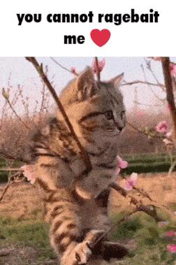

<h1 align="center">hiya</h1>

 

  im night, and i love uh coding

  i code in

    
  
</a>  

  

  
  <a href="https://github.com/NightIncorporated/NightIncorporated/pulls">make a pr to add some gifs!!</a>

  
  
  
  

